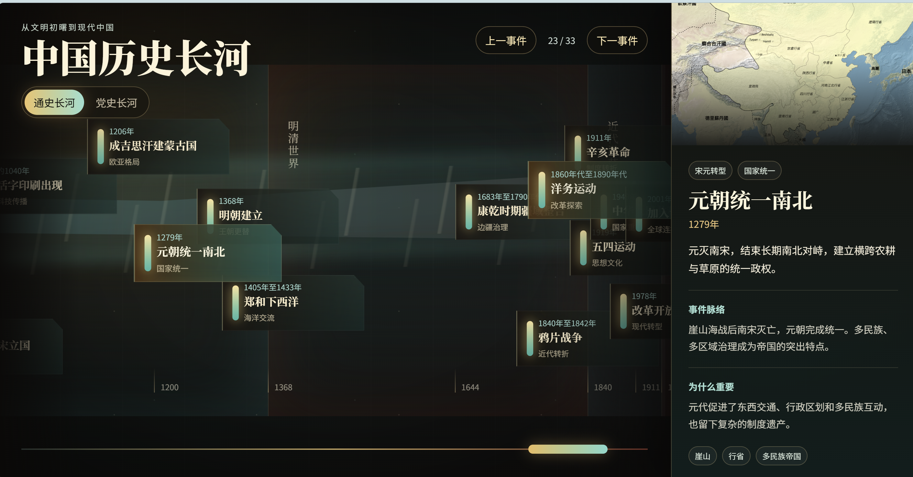
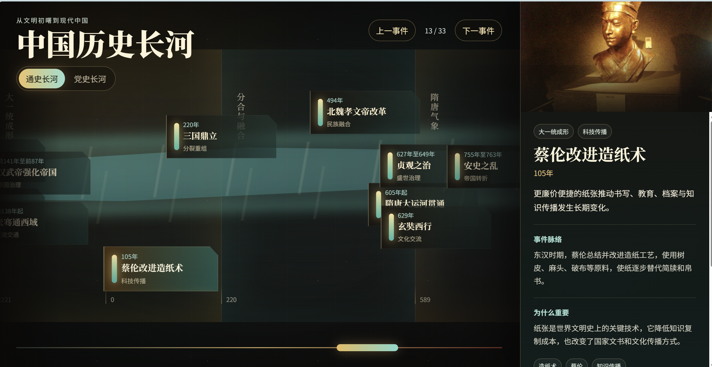

# 中国历史长河可视化

一个使用 Vue 3 + Vite 构建的横向可拖拽历史长河展示应用，包含“通史长河”和“党史长河”两条线路。节点详情保留本地科普内容；国内部署版本关闭 Wikimedia 请求，改用本地图片素材与权威来源链接，避免海外接口影响访问。

线上访问：

- Vercel: https://lishi-henna.vercel.app
- GitHub: https://github.com/51522yhj/histroyShow

> 提示：Vercel 和 Wikimedia 在中国大陆访问可能不稳定。面向国内用户时，建议将 `dist/` 部署到腾讯云 COS / CloudBase / EdgeOne 或阿里云 OSS + CDN，并使用 `public/images/events/` 中的本地素材。

## 展示样例

### 党史长河


### 通史长河：宋元明清转型



### 通史长河：科技与制度节点



## 功能亮点

- 横向拖拽长卷，支持鼠标、触摸和进度条快速定位。
- 双线路切换：通史长河、党史长河。
- 事件详情包含背景、脉络、影响、关键词和来源链接。
- 国内版优先使用本地图片素材，接口不可用时自动回退本地科普内容。
- 响应式布局，桌面端右侧详情面板，移动端底部详情抽屉。

## 本地运行

```bash
npm install
npm run dev
```

## 构建

```bash
npm run build
```

构建产物位于 `dist/`，可直接用于静态站点托管。

## 国内访问部署

项目已内置 CloudBase 静态网站托管的 GitHub Actions 工作流：

```text
.github/workflows/deploy.yml
```

在 GitHub 仓库中进入 `Settings -> Secrets and variables -> Actions`，添加：

- `TCB_SECRET_ID`: 腾讯云访问密钥 SecretId
- `TCB_SECRET_KEY`: 腾讯云访问密钥 SecretKey
- `TCB_ENV_ID`: CloudBase 环境 ID

推送到 `main` 后会自动构建并发布到 CloudBase 静态托管。该工作流会设置 `VITE_ENABLE_WIKI=false`，国内版本不请求 Wikimedia，避免页面因境外接口不可达而影响展示。

如需本地构建国内版本：

```bash
VITE_ENABLE_WIKI=false npm run build
```

## 国内图片素材

事件详情图通过 `src/data/eventImages.ts` 统一维护。国内版本建议把已授权图片放到：

```text
public/images/events/
```

然后在 `src/data/eventImages.ts` 中将事件 ID 映射到本地路径，例如：

```ts
'qin-unification': '/images/events/qin-unification.webp'
```

没有配置真实图片的节点会自动使用本地兜底图，保证 CloudBase 页面不会再因为海外图源或防盗链导致图片空白。
